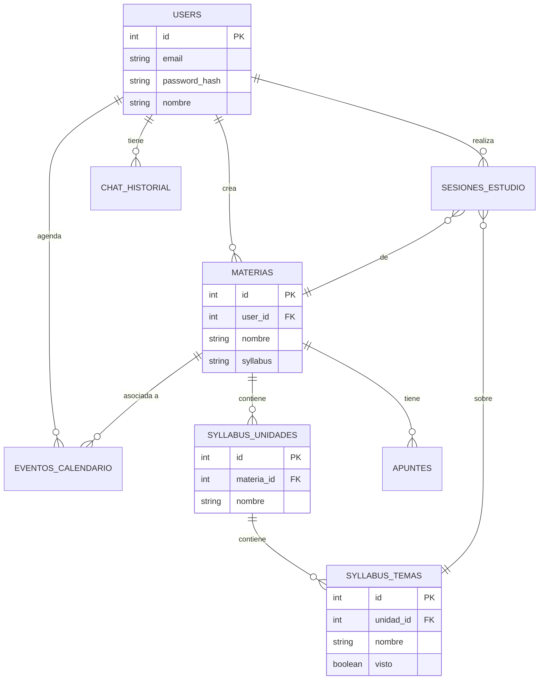
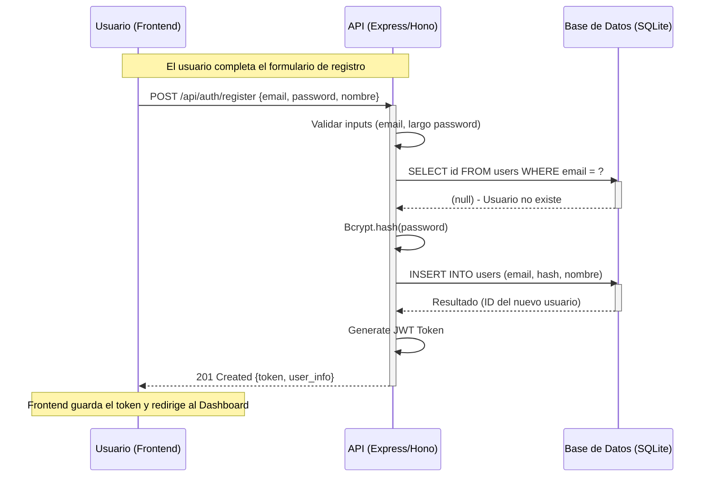

# Informe del Proyecto: Kivo Study Platform

## 1. Portada y Resumen Ejecutivo

**Nombre del Proyecto:** Kivo - Plataforma de Estudio Personalizada

**Integrantes:**
*   [Nombre del Integrante 1] - Backend Developer
*   [Nombre del Integrante 2] - Frontend Developer
*   [Nombre del Integrante 3] - QA / Testing
> *Nota: Por favor complete los nombres de los integrantes del equipo.*

**Stack Tecnológico:**
*   **Frontend:** React (Vite), TailwindCSS, FullCalendar, Recharts.
*   **Backend:** Node.js, Express (Entorno Local) / Hono (Producción en Cloudflare Workers).
*   **Base de Datos:** SQLite (Local) / Cloudflare D1 (Producción).
*   **Inteligencia Artificial:** Meta Llama 3.1 (Cloudflare Workers AI).
*   **Autenticación:** JWT (JSON Web Tokens), Bcryptjs.

---

## 2. Arquitectura del Sistema

El proyecto sigue una arquitectura **Cliente-Servidor (Client-Server)** desacoplada, donde el Frontend y el Backend funcionan como aplicaciones independientes que se comunican a través de una API RESTful. Esto garantiza la escalabilidad y facilita el mantenimiento.

### Capa de Presentación (Frontend)
Ubicada en el directorio `/frontend`. Responsable de todo lo que ve e interactúa el usuario.
*   **Tecnología:** React + Vite.
*   **Responsabilidades:**
    *   Renderizado de interfaces de usuario (UI) reactivas.
    *   Gestión del estado de la aplicación (Hooks de React).
    *   Manejo de rutas con `react-router-dom` (v7).
    *   Comunicación con el Backend mediante peticiones HTTP (fetch).
    *   **Componentes Clave:** Dashboard, Calendario, Chatbot, Gestión de Materias.

### Capa de Negocio (Business Layer)
Ubicada en `/backend/src`. Aquí reside la lógica principal de la aplicación.
*   **Tecnología:** Express (Local) / Hono (Cloudflare).
*   **Responsabilidades:**
    *   **Rutas (Routes):** Definidas en `/routes` (ej. `auth.js`, `materias.js`). Reciben las peticiones del cliente y orquestan la respuesta.
    *   **Middleware:** En `/middleware` (ej. `auth.js`). Maneja la validación de tokens JWT y protección de rutas.
    *   **Servicios:** Lógica compleja separada, como `ai-service.js` para la integración con Cloudflare Workers AI (Llama 3.1).
    *   La lógica de negocio (validaciones, hasheo de contraseñas, cálculos) se encuentra principalmente en los controladores de ruta para mantener la simplicidad, delegando tareas complejas a servicios específicos.

### Capa de Datos (Data Layer)
Gestión de la persistencia de la información.
*   **Tecnología:** SQLite / SQL.js.
*   **Responsabilidades:**
    *   **Abstracción:** El archivo `database/db.js` provee funciones helper (`dbPrepare`, `run`) para interactuar con la base de datos de manera segura, previniendo inyecciones SQL.
    *   **Esquema:** Definido en `database/schema.sql`, asegura la integridad relacional.

---

## 3. Diagrama de Base de Datos y Flujo

### Modelo Entidad-Relación (ER)

El esquema de base de datos está normalizado y centrado en el usuario (`users`), relacionando todas las entidades académicas a él.

### Diagrama de Secuencia: Registro de Usuario

Este diagrama ilustra el flujo de datos desde que el usuario ingresa sus datos hasta que se confirma la creación de la cuenta.

---

## 4. Implementación del Framework y Tecnologías

La elección del stack tecnológico se basó en criterios de rendimiento, experiencia de desarrollo y escalabilidad moderna.

1.  **Frontend: React + Vite + TailwindCSS**
    *   **React:** Permite construir interfaces modulares y reutilizables. Su ecosistema es vasto y facilita la gestión de estados complejos como el calendario o el chat.
    *   **Vite:** Herramienta de construcción de próxima generación que ofrece tiempos de inicio instantáneos y Hot Module Replacement (HMR) rápido, mejorando drásticamente la productividad.
    *   **TailwindCSS:** Framework de utilidad que permite diseñar interfaces modernas y responsivas directamente en el marcado, acelerando el desarrollo visual y garantizando consistencia.

2.  **Backend: Node.js + Hono/Express**
    *   **Node.js:** Permite usar JavaScript en todo el stack (Fullstack JS), unificando el lenguaje y permitiendo compartir tipos o lógica si fuera necesario.
    *   **Hono (para Producción):** Elegido específicamente para **Cloudflare Workers**. Es ultraligero, rápido y cumple con los estándares web modernos, ideal para una arquitectura Serverless escalable.
    *   **Express (para Desarrollo):** Usado localmente por su familiaridad y facilidad de configuración para pruebas rápidas.

3.  **Base de Datos: SQLite / Cloudflare D1**
    *   **SQLite:** Base de datos relacional robusta que no requiere configuración de servidor, perfecta para desarrollo y pruebas.
    *   **Cloudflare D1:** La primera base de datos SQL serverless de Cloudflare, que permite llevar la simplicidad de SQLite al borde (Edge), ofreciendo baja latencia global.

4.  **Inteligencia Artificial: Meta Llama 3.1**
    *   Integrado a través de **Cloudflare Workers AI**. Ejecutamos el modelo Llama 3.1 directamente en el borde (Edge), lo que garantiza baja latencia y privacidad, sin depender de APIs externas costosas.

---

## 5. Demostración

La aplicación cuenta con módulos funcionales clave:

*   **Autenticación Segura:** Registro e inicio de sesión con encriptación y sesiones persistentes.
*   **Dashboard Personalizado:** Vista general del progreso, próximas tareas y estadísticas de estudio.
*   **Gestor de Materias y Syllabus:** Creación de materias y seguimiento granular del avance por temas.
*   **Chatbot Educativo:** Asistente IA ("Panda Coach") capaz de responder preguntas sobre las materias registradas usando Llama 3.1.
*   **Calendario Interactivo:** Planificación visual de sesiones de estudio y eventos académicos.

---

## 6. Conclusiones y Futuras Mejoras

### Lecciones Aprendidas
*   **Importancia del Desacoplamiento:** Separar frontend y backend permitió trabajar en paralelo y simplificó la depuración de errores.
*   **Gestión de Estado:** El uso de contextos en React fue crucial para mantener la información del usuario y las materias sincronizada a través de diferentes vistas.
*   **Adaptabilidad:** Diseñar para Serverless (Cloudflare) desde el principio requiere considerar las limitaciones de entorno (como no tener sistema de archivos persistente local), lo que llevó a mejores prácticas de arquitectura.

### Escalabilidad y Mejoras Futuras
*   **Microservicios:** La arquitectura actual permite extraer el servicio de IA a un worker independiente si la carga aumenta.
*   **Modo Offline:** Implementar Service Workers (PWA) para permitir el acceso a apuntes sin conexión a internet.
*   **Colaboración en Tiempo Real:** Añadir WebSockets para sesiones de estudio grupales o chat en vivo entre estudiantes.
